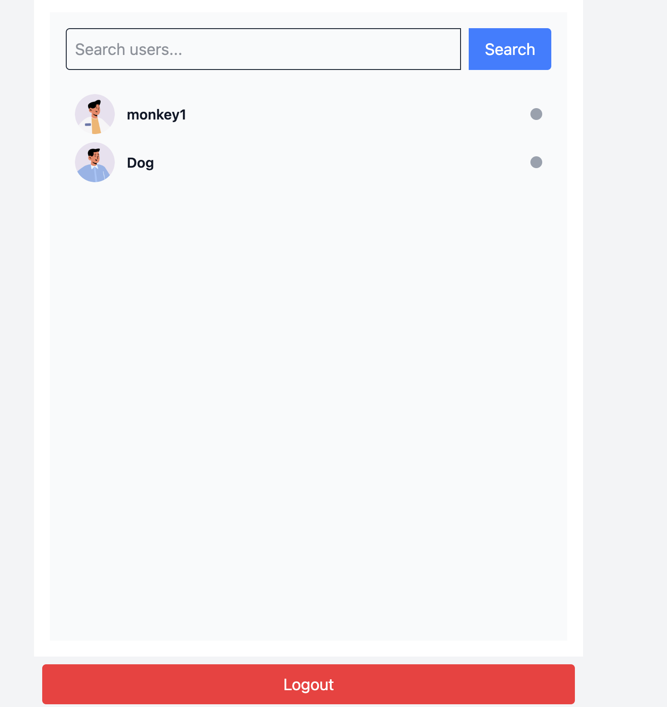
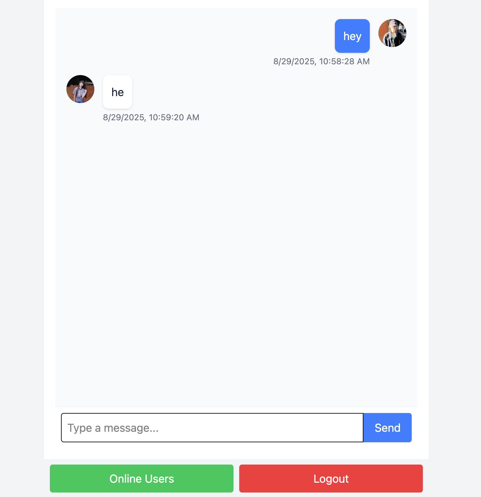

# Chat App

This is a simple real-time chat app.  
It uses **MongoDB**, **Express**, **React**, and **Socket.IO**.

## Features

- Real-time chat with Socket.IO
- User login and register
- Messages saved in MongoDB
- Easy to start with one command

## Setup

### 1. Clone the project

```bash
git clone https://github.com/tacesept/chat-app.git
cd chat-app
```

### 2. Add `.env` file

In the project root, make a file called `.env` and add:

```
MONGO_URI=your_mongodb_url
PORT=5001
JWT_SECRET=your_secret_key
NODE_ENV=production
```

👉 To create a secret key, run this in terminal:

```bash
openssl rand -base64 32
```

### 3. Install packages

```bash
npm run build
npm start
```

The app will run on:

```
http://localhost:5001
```

## Screenshots

<p align="center">
  
  
</p>
